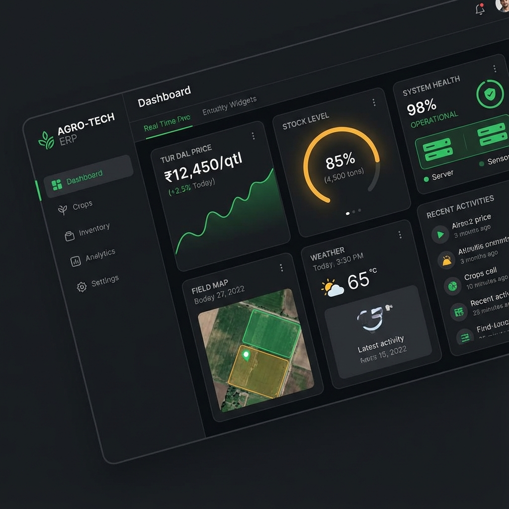
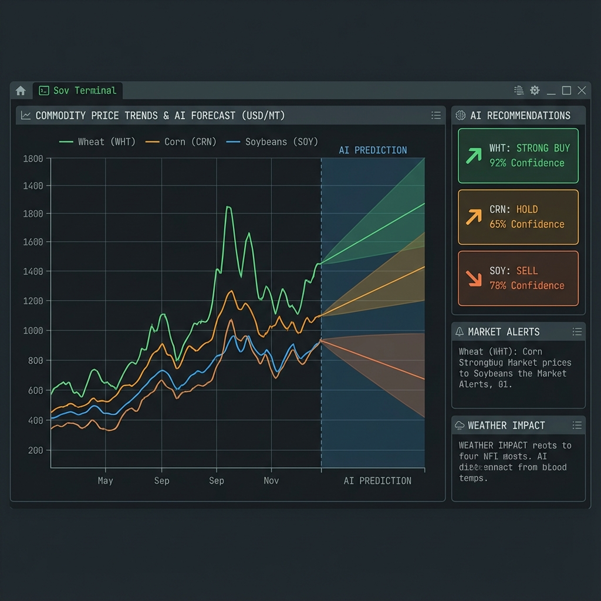

# D-Farms ERP: AI-Powered Agricultural Intelligence 🌾


**D-Farms ERP** is a comprehensive Enterprise Resource Planning system designed for modern agricultural processing. It unifies **Procurement, Manufacturing, Inventory, and Quality Control** into a single platform, supercharged by an **AI Agent** that provides real-time market intelligence.

---

## 📸 Dashboard Preview


*(Note: Please upload your real dashboard screenshot here to replace this placeholder)*

---

## 🏗️ System Architecture

D-Farms uses a **Hybrid Cloud Architecture** to combine the speed of serverless frontend with the power of persistent AI agents.

```mermaid
graph TD
    User[User / Admin] -->|HTTPS| Frontend[Cloud Run Frontend\n(Next.js 16)]
    
    subgraph "Google Cloud Platform"
        Frontend -->|SQL| DB[(Supabase PostgreSQL)]
        Frontend -->|API| AI_Agent[Backend Agent VM\n(Python CrewAI)]
        
        AI_Agent -->|Polls| DB
        AI_Agent -->|Fetches| External[data.gov.in / News API]
    end
    
    subgraph "Core Modules"
        Frontend -.->|Manage| MM[Inventory & Manufacturing]
        Frontend -.->|Analyze| MI[Market Intelligence]
        Frontend -.->|Check| QC[Quality Control]
    end
```

---

## 🚀 Key Features

### 1. 🧠 AI Market Intelligence
The **Market Intel Agent** works 24/7 to analyze commodity trends.
- **Real-time Data:** Fetches daily prices from 240+ markets via government APIs.
- **Multi-Factor Analysis:** Combines **Technical Analysis** (Moving Averages, RSI) with **News Sentiment** to generate Buy/Sell signals.
- **Visual Insights:** See the exact confidence score and reasoning behind every recommendation.



### 2. 🏭 Manufacturing & Inventory
Track every grain from **Gate Entry to Finished Packet**.
- **Batch Tracking:** Full traceability with unique Batch IDs (`BATCH-1025`).
- **Processing:** Monitor stages (Cleaning, Milling, Packing) and calculate **Yield Efficiency**.
- **Stock Management:** Multi-warehouse inventory with low-stock alerts.


### 3. 🛡️ Quality Control (Lab Integration)
Ensure premium quality with integrated lab reporting.
- **Digital Lab Reports:** Record Moisture, Foreign Matter, and Admixture % directly linked to batches.
- **Grading Logic:** Auto-grade batches (Grade A/B/C) based on test results.


---

## 🛠️ Technology Stack

| Component | Technology | Description |
|-----------|------------|-------------|
| **Frontend** | Next.js 16 | React Server Components, Tailwind CSS, Recharts |
| **Backend** | Python 3.11 | CrewAI Agents, Pandas (Analytics), FastAPI |
| **Database** | Supabase | PostgreSQL 15, PgVector (for RAG), Pooler |
| **Infra** | Google Cloud | Cloud Run (Web), Compute Engine (Agents), Artifact Registry |

---

## 🏁 Getting Started

### Prerequisites
- Node.js 18+
- Python 3.11
- Google Cloud SDK

### 1. clone the Repository
```bash
git clone https://github.com/KrishnaVidhul/dfarms.git
cd dfarms
```

### 2. Setup Environment
```bash
cp src/web/.env.example src/web/.env.local
# Add DATABASE_URL, GROQ_API_KEY, DATA_GOV_API_KEY
```

### 3. Run Locally (Frontend)
```bash
cd src/web
npm install
npm run dev
# Opens http://localhost:3000
```

### 4. Run AI Agents
```bash
cd src/agent_runtime
pip install -r requirements.txt
python super_agent.py
```

---

## 🤝 Contributing

We welcome contributions! Please see `CONTRIBUTING.md` for guidelines.
**Note:** `src/scripts/fetch_production_data.py` is a critical core file. Please do not modify it without verified tests.

---

### 📄 License
Proprietary - D-Farms Systems.
